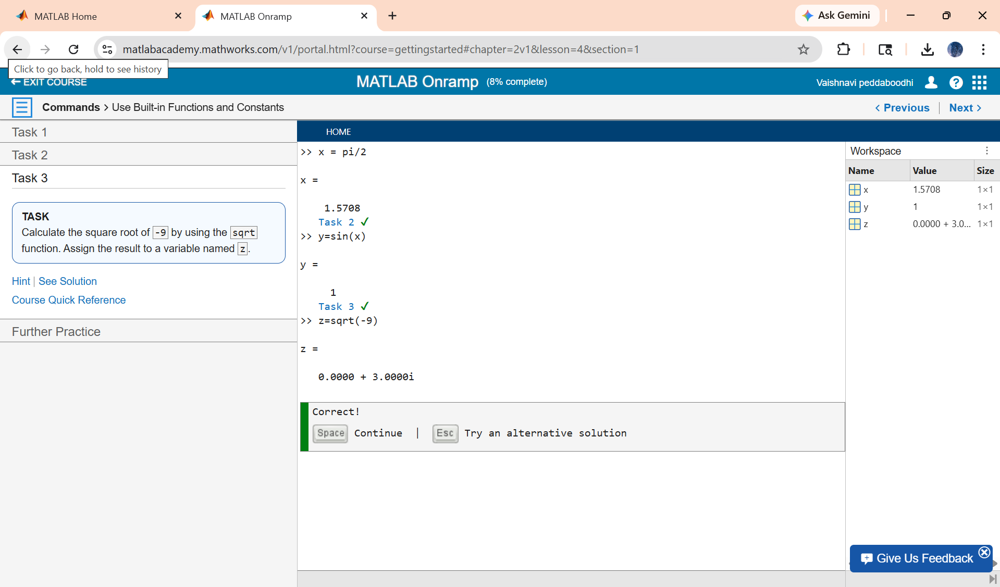
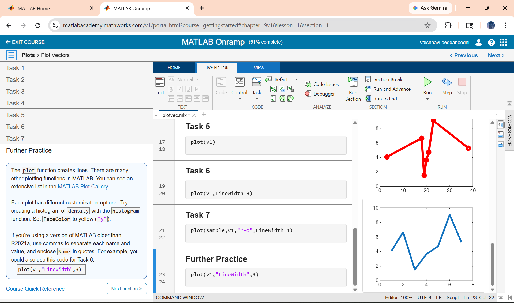
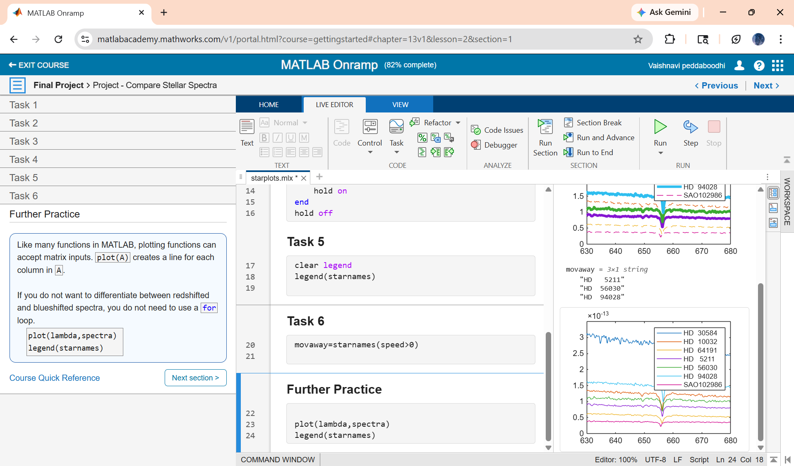

# MATLAB Onramp Completion

## Overview
Completed MATLAB Onramp course from MathWorks.

## Certificate
[View Certificate](certificate/matlab_certificate.pdf)

## Learning Progress

## Skills Gained
- MATLAB basics
- Matrix operations
- Data visualization
- Basic programming
